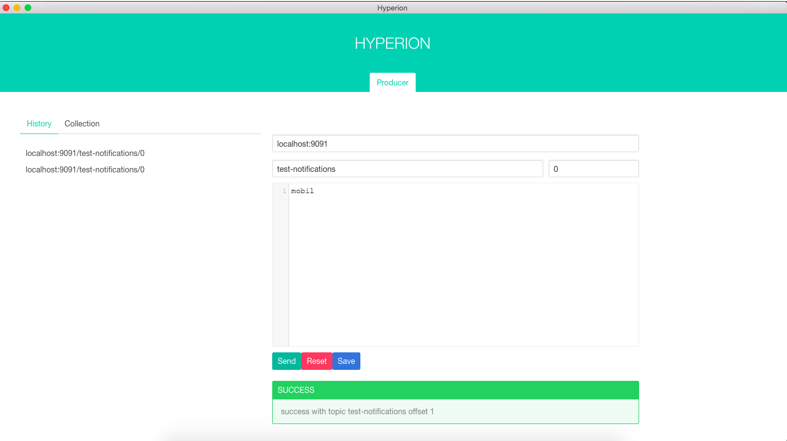
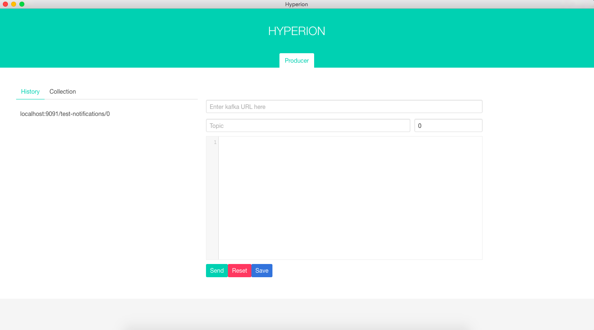

# HYPERION
Hyperion is Kafka UI for produce and consume messages. It is built with electron, react, redux, and bulma css.

## Feature
Currently hyperion only provide producer. Consumer will come up on the next release.

Producer Feature:
* Publish Message to Kafka & History


* Store Template into collection


## Development
### install
```
npm install -g node-gyp
npm install -g electron
npm install
```

to run:
```
npm run start
```

## Known Dependency Bug
Hyperion use no-kafka package to produce message to kafka. There is 1 bug that have not been resolved. When hyperion cannot connect to valid kafka url(have host and port) it will keep retrying forever. It will cause the form status to `sending` for forever. The only solution for now, is to restart the producer(close the app then open it again) or refresh the page(WINDOWS/LINUX: using `CTRL + R`, MacOS: `CMD + R`)
## License

[MIT](https://github.com/wendy0402/hyperion/blob/master/LICENSE)
